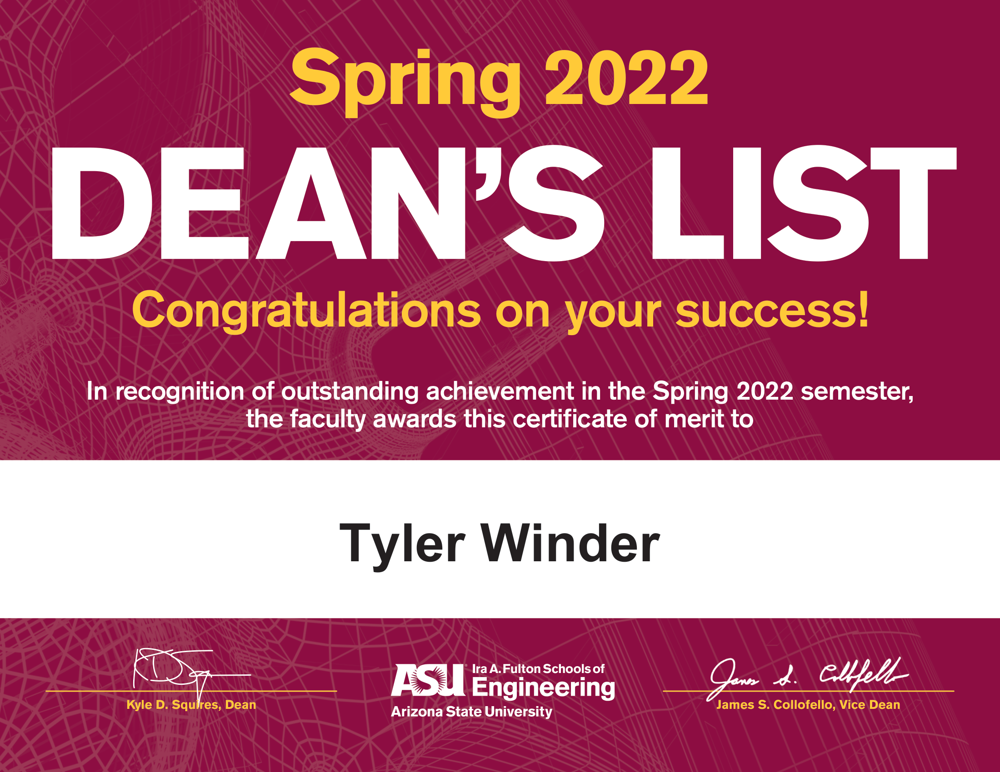
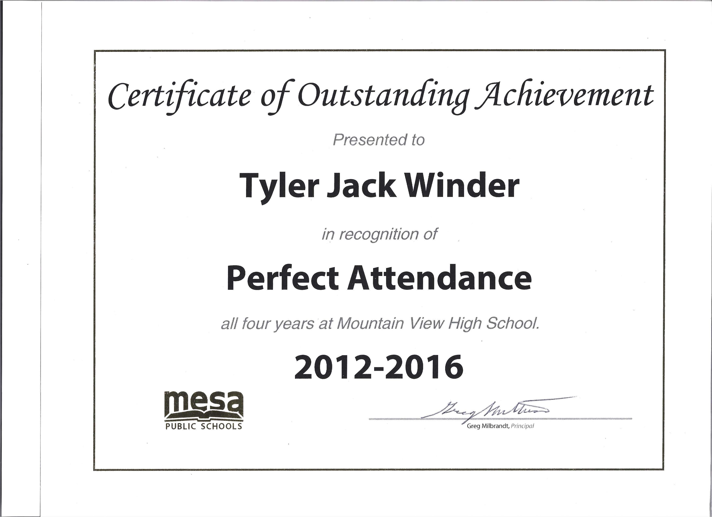
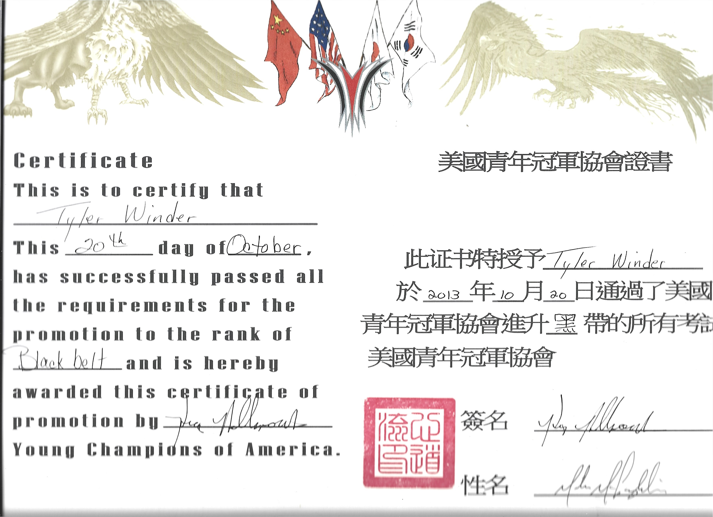
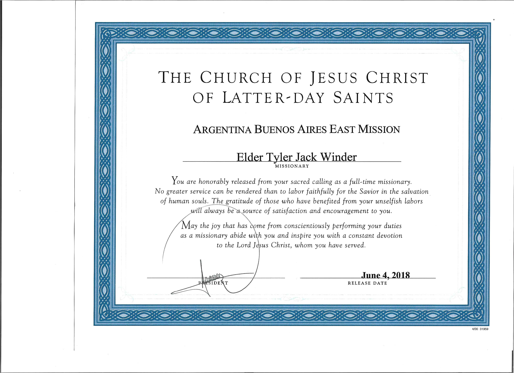
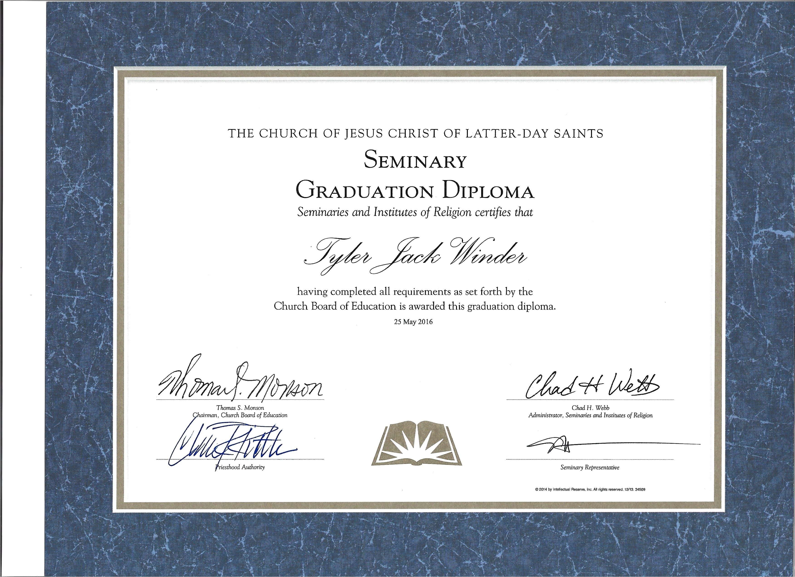
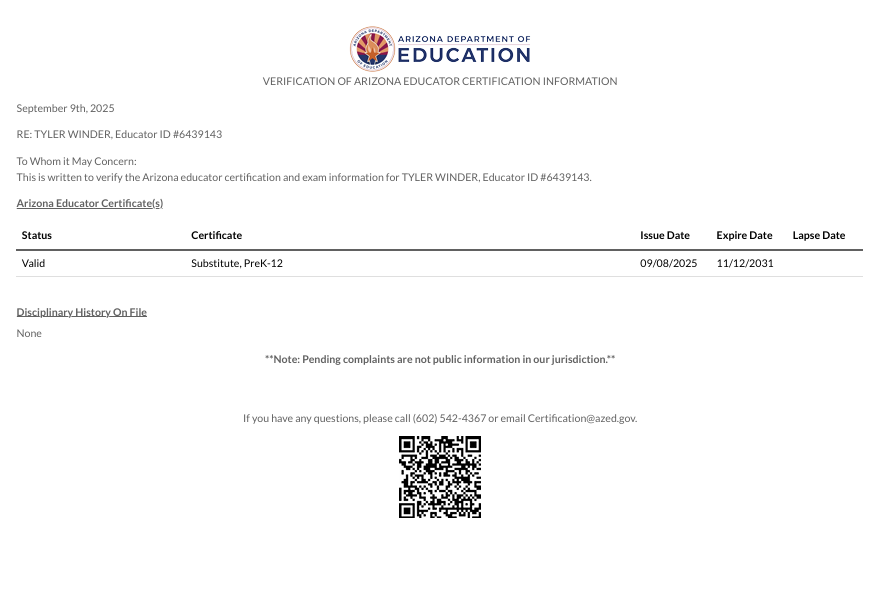

# About me

My name is Tyler Winder and I am currently a dual major in electrical and software engineering. I have am a National Honor society member and have made the Dean's List for the past two years.

I am a very hardworking and determined individual. As if this wasn't enough, I am also a black belt in Karate, an Eagle Scout, and I spent two years of my life as a Church Service Missionary in Buenos Aires, Argentina.
# Projects
## EGR 101
[Link to EGR 101 Final Project](/EGR101.md)
## EGR 102
[Link to EGR 102 Final Project](/EGR102.md)
## EGR 201
[Link to Life Cycle Analysis](/Life_Cycle_Analysis.md)

[Link to Final Project Modeling Appendix](/Final_Project_Modeling_Appendix.md)

[Link to Final Project Dissemination](/final_Project_Dissemination.md)

## EGR 202
[Link to EGR 202 Final Project](/EGR202.md)
## EGR 304
[Link to EGR 304 Final Project](EGR_304_Final_Project.md)

[Link to working product video](https://www.youtube.com/watch?v=ogYLJQNt4fU)
## EGR 314
[Link to EGR 314 current progress](https://team-302.github.io/)

## Electrical Capstone
[Link to Electrical Capstone](https://drive.google.com/drive/folders/15yLvw7X1uW4zCVzxmLmZg3qk53488I6b?usp=sharing)

## Software Capstone
[Link to Software Capstone](https://drive.google.com/drive/folders/1KBTAUH5FlOX45L2F5Yo_HSH1Hz0hNgeP?usp=sharing)
# Certificates
.png)
.png)
.png)

.png)

